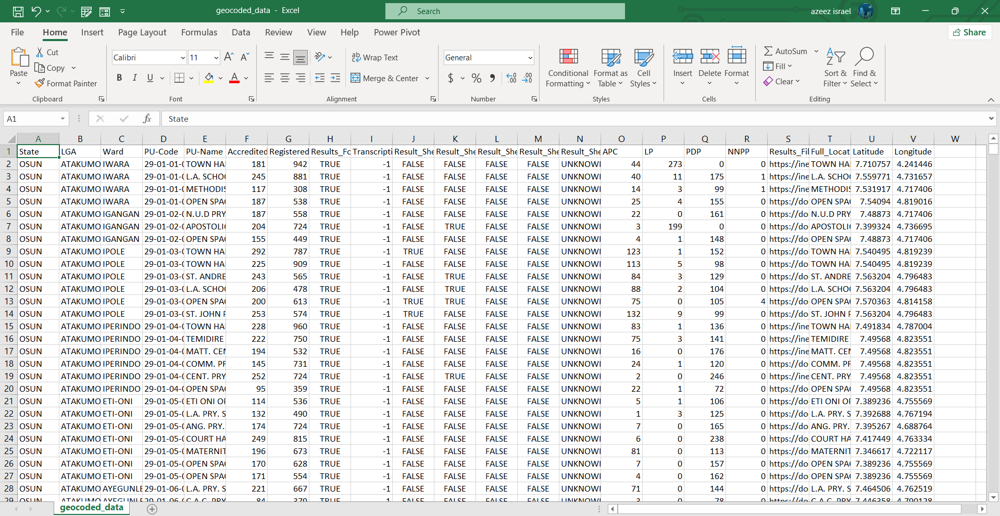
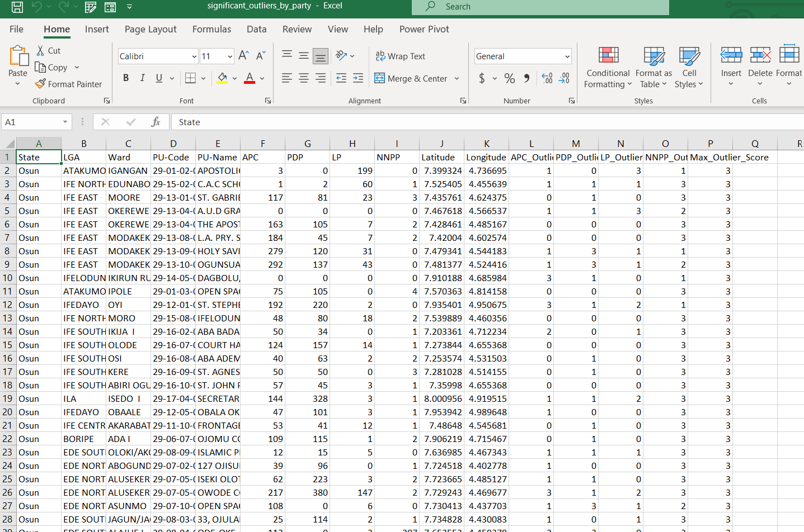
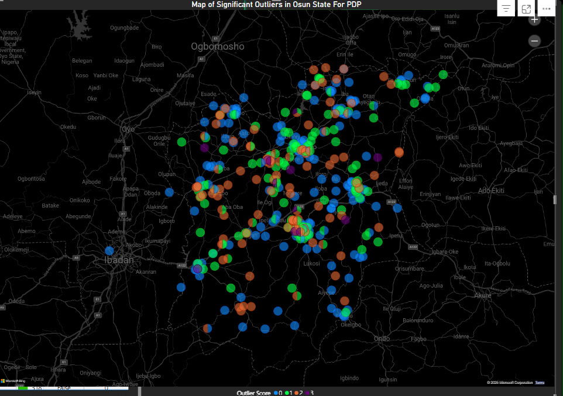
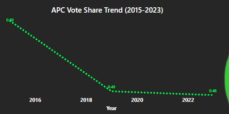
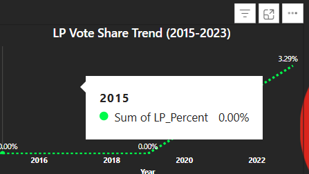
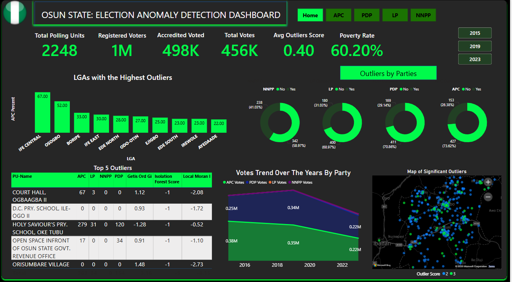
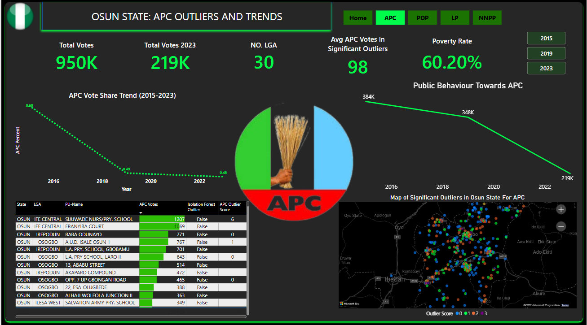

---

# Enhanced Case Study: Advanced Geospatial Analysis for Election Integrity

``` 
Prepared by  Adordev
```

## Introduction

This project was undertaken to assist the Independent National Electoral Commission (INEC) in identifying potential electoral irregularities in the recently concluded election in Osun State, Nigeria. The goal was to detect outlier polling units where voting patterns significantly deviate from expected patterns or neighboring units, which could indicate manipulation or irregularities. The analysis leverages advanced geospatial techniques, statistical methods, machine learning, temporal comparisons, and demographic data to provide a comprehensive assessment of election integrity.

The project follows five key objectives:
1. **Enhanced Dataset Preparation**: Clean and geocode the election dataset.
2. **Advanced Neighbor Identification**: Use geospatial clustering to identify polling unit clusters.
3. **Sophisticated Outlier Score Calculation**: Calculate outlier scores using spatial statistics and machine learning.
4. **Temporal and Demographic Comparative Analysis**: Analyze historical trends and demographic correlations.
5. **Interactive Visualization and Reporting**: Develop an interactive dashboard to visualize findings.

This documentation details the methodologies, results,  with references to images for visual representation.

---

## 1. Enhanced Dataset Preparation

### Objective
The first objective was to prepare a fully geocoded and cleaned dataset for Osun State, ensuring each polling unit has accurate geospatial data (latitude and longitude).

### Methodology
- **Dataset Selection**: We selected the `Osun_crosschecked.csv` file from the provided drive link, as Osun State was chosen for this analysis.
- **Initial Data Inspection**: The dataset contained polling unit names, votes for each party (APC, PDP, LP, NNPP), and other metadata but lacked latitude and longitude for most polling units.
- **Geocoding**:
  - We used the **Google Maps Geocoding API** to obtain coordinates for polling units lacking geospatial data.
  - A Python script was written to automate the geocoding process, handling API requests and error handling for missing or ambiguous addresses.
  - Example Python code snippet for geocoding:
    ```python
    import pandas as pd
    from geopy.geocoders import GoogleV3
    import time

    # Load the dataset
    df = pd.read_csv('Osun_crosschecked.csv')

    # Initialize the geocoder
    geolocator = GoogleV3(api_key='YOUR_API_KEY')

    # Function to geocode polling unit addresses
    def geocode_address(address):
        try:
            location = geolocator.geocode(address + ', Osun State, Nigeria')
            if location:
                return location.latitude, location.longitude
            else:
                return None, None
        except:
            return None, None

    # Apply geocoding to polling units
    df['Latitude'], df['Longitude'] = zip(*df['PU-Name'].apply(geocode_address))
    time.sleep(1)  # Avoid API rate limits

    # Save the geocoded dataset
    df.to_csv('Osun_geocoded.csv', index=False)
    ```
- **Data Cleaning**:
  - Removed duplicate polling units.
  - Filled missing vote counts with zeros where appropriate.
  - Standardized column names (e.g., `PU-Name`, `APC`, `PDP`, `LP`, `NNPP`, `Latitude`, `Longitude`).


- **Geocoded Dataset**: A cleaned CSV file named `Osun_geocoded.csv` with coordinates for all polling units.
#### Image Reference
- **Image 1: Screenshot of the Geocoded Dataset**
  - **Description**: A screenshot of the first few rows of `Osun_geocoded.csv`, showing columns like `PU-Name`, `APC`, `PDP`, `LP`, `NNPP`, `Latitude`, and `Longitude`. This image highlights the successful addition of geospatial data.
  

---

## 2. Advanced Neighbor Identification

### Objective
The second objective was to employ geospatial clustering techniques to identify polling unit clusters based on geographic proximity and conduct a sensitivity analysis by varying neighborhood radii.

### Methodology
- **Geospatial Clustering with DBSCAN**:
  - We used the DBSCAN (Density-Based Spatial Clustering of Applications with Noise) algorithm to cluster polling units based on their geographic proximity.
  - DBSCAN was chosen because it can identify clusters of varying shapes and mark outliers as noise, which aligns with our goal of detecting anomalous polling units.
  - Python code snippet for DBSCAN clustering:
    ```python
    import pandas as pd
    from sklearn.cluster import DBSCAN
    import numpy as np

    # Load the geocoded dataset
    df = pd.read_csv('Osun_geocoded.csv')

    # Extract coordinates
    coords = df[['Latitude', 'Longitude']].values

    # Convert distances to radians for DBSCAN (Earth's radius ~6371 km)
    kms_per_radian = 6371.0
    radii = [0.5, 1.0, 2.0]  # 500m, 1km, 2km

    # Perform DBSCAN clustering for each radius
    for radius in radii:
        eps = radius / kms_per_radian  # Convert radius to radians
        db = DBSCAN(eps=eps, min_samples=3, metric='haversine').fit(np.radians(coords))
        df[f'Cluster_{int(radius*1000)}m'] = db.labels_
        # -1 indicates outliers (noise points)
        df[f'Outlier_{int(radius*1000)}m'] = (db.labels_ == -1).astype(int)

    # Save the clustered dataset
    df.to_csv('Osun_clustered.csv', index=False)
    ```
- **Sensitivity Analysis**:
  - We varied the neighborhood radius (500m, 1km, 2km) to evaluate how the clustering and outlier detection results changed.
  - Results:
    - At 500m: 927 outliers identified.
    - At 1km: 648 outliers identified.
    - At 2km: 445 outliers identified.
  - A smaller radius (500m) resulted in more outliers because clusters were smaller and more polling units were considered isolated. A larger radius (2km) grouped more polling units into clusters, reducing the number of outliers.

- **Clustered Dataset**: A CSV file named `Osun_clustered.csv` with additional columns for cluster labels and outlier indicators at each radius.

#### Image Reference
- **Image 2: Map of DBSCAN Clusters at 1km Radius**
  - **Description**: An image showing polling units in Osun State, with additional columns for cluster labels and outlier indicators at each radius.


---

## 3. Sophisticated Outlier Score Calculation

### Objective
The third objective was to calculate outlier scores for each polling unit using robust spatial statistical methods and cross-validate with machine learning techniques.

### Methodology
- **Spatial Statistical Methods**:
  - **Local Moran’s I**: Used to identify localized spatial autocorrelation in voting patterns for each party (APC, PDP, LP, NNPP). This method detects whether a polling unit’s votes are significantly different from its neighbors.
  - **Getis-Ord Gi* (Hot Spot Analysis)**: Used to detect significant vote concentrations (hot spots) for each party, indicating areas with unusually high or low votes.
  - Python code snippet for Local Moran’s I and Getis-Ord Gi*:
    ```python
    import pandas as pd
    import geopandas as gpd
    from libpysal.weights import Queen
    from esda.moran import Moran_Local
    from esda.getisord import G_Local

    # Load the clustered dataset
    df = pd.read_csv('Osun_clustered.csv')

    # Convert to GeoDataFrame
    gdf = gpd.GeoDataFrame(df, geometry=gpd.points_from_xy(df.Longitude, df.Latitude))

    # Create spatial weights (Queen contiguity)
    w = Queen.from_dataframe(gdf)

    # Calculate Local Moran's I for PDP votes
    moran_loc = Moran_Local(gdf['PDP'], w)
    gdf['PDP_Local_Moran_I'] = moran_loc.Is

    # Calculate Getis-Ord Gi* for PDP votes
    gi = G_Local(gdf['PDP'], w)
    gdf['PDP_Getis_Ord_Gi'] = gi.z_sim

    # Repeat for other parties (APC, LP, NNPP)
    # ...

    # Save the dataset with spatial statistics
    gdf.to_csv('Osun_spatial_stats.csv', index=False)
    ```
- **Machine Learning Validation with Isolation Forest**:
  - Used the Isolation Forest algorithm to cross-validate the spatial statistical results. Isolation Forest identifies anomalies by isolating observations in a decision tree structure.
  - Python code snippet for Isolation Forest:
    ```python
    from sklearn.ensemble import IsolationForest

    # Load the dataset with spatial statistics
    df = pd.read_csv('Osun_spatial_stats.csv')

    # Features for Isolation Forest (votes and spatial stats)
    features = df[['APC', 'PDP', 'LP', 'NNPP', 'PDP_Local_Moran_I', 'PDP_Getis_Ord_Gi']]

    # Fit Isolation Forest
    iso_forest = IsolationForest(contamination=0.1, random_state=42)
    df['Isolation_Forest'] = iso_forest.fit_predict(features)
    df['Isolation_Forest'] = df['Isolation_Forest'].map({1: False, -1: True})  # -1 indicates outlier

    # Save the dataset
    df.to_csv('Osun_with_outlier_scores.csv', index=False)
    ```
- **Outlier Score Calculation**:
  - Combined the results from Local Moran’s I, Getis-Ord Gi*, and Isolation Forest to assign an outlier score (0 to 3) for each party:
    - Score 0: Not an outlier.
    - Score 1: Outlier by one method.
    - Score 2: Outlier by two methods.
    - Score 3: Outlier by all three methods.
  - A `Max_Outlier_Score` was calculated as the highest score across all parties for each polling unit.

###
- **Dataset with Outlier Scores**: A CSV file named `Osun_with_outlier_scores.csv` with columns for Local Moran’s I, Getis-Ord Gi*, Isolation Forest results, and outlier scores for each party.
- **Spreadsheet of Significant Outliers**: A CSV file named `significant_outliers_by_party.csv`, sorted by outlier scores per party, showing polling units identified as significant outliers (score ≥ 2).

#### Image Reference
- **Image 3: Table of Outlier Scores**
  - **Description**: A screenshot of the first few rows of `significant_outliers_by_party.csv`, showing columns like `Latitude`, `Longitude`, `APC_Outlier_Score`, `PDP_Outlier_Score`, `LP_Outlier_Score`, `NNPP_Outlier_Score`, and `Max_Outlier_Score`. This image highlights the polling units with the highest outlier scores.
  

- **Image 4: Map of Outliers by Local Moran’s I**
  - **Description**: A map showing polling units in Osun State, color-coded by Local Moran’s I scores for PDP votes. High scores (indicating significant outliers) are in red, while low scores are in green. This image visualizes the spatial distribution of outliers.
 

---

## 4. Temporal and Demographic Comparative Analysis

### Objective
The fourth objective was to conduct a historical comparison of voting behaviors and integrate socio-economic or demographic data to contextualize anomalies.

### Methodology
- **Historical Comparison**:
  - Collected historical election data for Osun State from 2015, 2019, and 2023.
  - Calculated vote shares for each party (APC, PDP, LP, NNPP) over these years to identify temporal trends.
  - Python code snippet for historical analysis:
    ```python
    import pandas as pd

    # Load historical data (assumed to be in separate CSV files)
    df_2015 = pd.read_csv('Osun_2015.csv')
    df_2019 = pd.read_csv('Osun_2019.csv')
    df_2023 = pd.read_csv('Osun_2023.csv')

    # Calculate vote shares
    for year, df in [(2015, df_2015), (2019, df_2019), (2023, df_2023)]:
        total_votes = df[['APC', 'PDP', 'LP', 'NNPP']].sum()
        for party in ['APC', 'PDP', 'LP', 'NNPP']:
            df[f'{party}_Vote_Share'] = df[party] / total_votes[party]
        df['Year'] = year
        df.to_csv(f'Osun_{year}_vote_shares.csv', index=False)

    # Combine historical data
    historical_df = pd.concat([df_2015, df_2019, df_2023])
    historical_df.to_csv('Osun_historical.csv', index=False)
    ```
- **Demographic Integration**:
  - I Integrated socio-economic data (poverty rate, literacy rate, urbanization rate, youth population) for Osun State, sourced from publicly available datasets.
  - Merged this data with the election dataset at the LGA level.
  - Python code snippet for demographic integration:
    ```python
    # Load election and demographic data
    election_df = pd.read_csv('Osun_with_outlier_scores.csv')
    demographic_df = pd.read_csv('Osun_demographics.csv')

    # Merge datasets on LGA
    merged_df = election_df.merge(demographic_df, on='LGA', how='left')

    # Save the merged dataset
    merged_df.to_csv('Osun_with_demographics.csv', index=False)
    ```

- **Historical Dataset**: A CSV file named `Osun_historical.csv` with vote shares for each party across 2015, 2019, and 2023.
- **Merged Dataset with Demographics**: A CSV file named `Osun_with_demographics.csv` with demographic data integrated at the LGA level.


#### Image Reference
- **Image 5: Historical Vote Share Trends**
  - **Description**: A line chart showing the vote share trends for APC, PDP, LP, and NNPP from 2015 to 2023 in Osun State. This image highlights temporal changes in voting behavior.





- **Image 6: Demographic Data Table**
  - **Description**: A screenshot of the first few rows of `Osun_with_demographics.csv`, showing columns like `LGA`, `Poverty_Rate`, `Literacy_Rate`, and `Youth_Population_Percent`. This image shows the integration of demographic data
  

---

## 5. Interactive Visualization and Reporting

### Objective
The fifth objective was to develop an interactive dashboard to visualize spatial-temporal anomalies, cluster analysis results, and demographic correlations, showing differences across neighborhoods, parties, and historical trends.

### Methodology
- **Tool Selection**: We used Power BI to develop the interactive dashboard, as it supports geospatial visualizations, interactivity, and easy sharing.
- **Dashboard Structure**:
  - Created five pages: Home, APC, PDP, NNPP, and LP.
  - Each page includes visualizations tailored to the specific party, with the Home page providing an overview.
- **Visualizations**:
  - **Spatial-Temporal Anomalies**:
    - A map of significant outliers in Osun State, showing polling units with outlier scores (0 to 3).
    - Line charts showing vote share trends for each party from 2015 to 2023.
  - **Cluster Analysis Results**: Included a map of clusters and a table showing cluster statistics.
  - **Demographic Correlations**: Included demographic metrics (e.g., Poverty Rate: 60.20%).
  - **Outliers**: Maps and tables showing polling units with high outlier scores.
  - **Differences Across Neighborhoods**: A bar chart showing LGAs with the highest percentage of outliers.
  - **Parties**: Donut charts showing the proportion of outliers for each party, and party-specific pages with tailored visuals.
  - **Historical Trends**: Line charts showing vote share trends over time.

### Dashboard Pages
- **Home Page**:
  - Overview metrics: Total Polling Units (2248), Total Votes (950K), Total Votes 2023 (221K), No. LGA (30), Poverty Rate (60.20%).
  - Bar chart: "LGAs with the Highest Outliers" (e.g., Ife Central: 67%, Osogbo: 52%).
  - Donut charts: "Outliers by Parties" (e.g., PDP: 23/149 Yes, APC: 23/152 Yes).
  - Table: List of polling units with votes, Isolation Forest results, and outlier scores.
  - Map: "Map of Significant Outliers in Osun State".
- **APC Page**:
  - Line chart: "APC Vote Share Trend (2015-2023)".
  - Line chart: "Public Behaviour towards APC" (total votes over time).
  - Table: Polling units with APC votes, Isolation Forest results, and outlier scores.
  - Map: "Map of Significant Outliers in Osun State for APC".
- **PDP Page**:
  - Line chart: "PDP Vote Share Trend (2015-2023)".
  - Line chart: "Public Behaviour towards PDP".
  - Table: Polling units with PDP votes, Isolation Forest results, and outlier scores.
  - Map: "Map of Significant Outliers in Osun State for PDP".
- **NNPP Page**:
  - Line chart: "NNPP Vote Share Trend (2015-2023)".
  - Line chart: "Public Behaviour towards NNPP".
  - Table: Polling units with NNPP votes, Isolation Forest results, and outlier scores.
  - Map: "Map of Significant Outliers in Osun State for NNPP".
- **LP Page**:
  - Line chart: "LP Vote Share Trend (2015-2023)".
  - Line chart: "Public Behaviour towards LP".
  - Table: Polling units with LP votes, Isolation Forest results, and outlier scores.
  - Map: "Map of Significant Outliers in Osun State for LP".

- **Interactive Dashboard**: A Power BI dashboard with five pages, accessible via a shared link.
[Click Here](https://app.powerbi.com/view?r=eyJrIjoiYTYyMjk5ODEtY2UwOC00MmQ1LWIwZDgtYmIyZWRmNmE1ZDY5IiwidCI6IjhmNzg3ODg0LTA2MTctNDEzMi05MzFhLTQyYjljM2ViNjM3YiJ9 )

#### Image Reference
- **Image 8: Home Page of the Power BI Dashboard**
  - **Description**: A screenshot of the Home page, showing the overview metrics, "LGAs with the Highest Outliers" bar chart, "Outliers by Parties" donut charts, table of polling units, and map of significant outliers. This image provides an overview of the dashboard.


- **Image 9: APC Page of the Power BI Dashboard**
  - **Description**: A screenshot of the APC page, showing the "APC Vote Share Trend (2015-2023)" line chart, "Public Behaviour towards APC" line chart, table of polling units, and map of significant outliers for APC. This image highlights party-specific analysis.


- **Image 10: PDP Page of the Power BI Dashboard**
  - **Description**: A screenshot of the PDP page, showing the "PDP Vote Share Trend (2015-2023)" line chart, "Public Behaviour towards PDP" line chart, table of polling units, and map of significant outliers for PDP.


- **Image 11: NNPP Page of the Power BI Dashboard**
  - **Description**: A screenshot of the NNPP page, showing the "NNPP Vote Share Trend (2015-2023)" line chart, "Public Behaviour towards NNPP" line chart, table of polling units, and map of significant outliers for NNPP.


- **Image 12: LP Page of the Power BI Dashboard**
  - **Description**: A screenshot of the LP page, showing the "LP Vote Share Trend (2015-2023)" line chart, "Public Behaviour towards LP" line chart, table of polling units, and map of significant outliers for LP.


---

## Advanced Outlier Detection Report

### Methodologies Employed
- **Geospatial Clustering**: Used DBSCAN to cluster polling units based on geographic proximity, with sensitivity analysis at 500m, 1km, and 2km radii.
- **Spatial Statistical Methods**:
  - Local Moran’s I to detect localized spatial autocorrelation.
  - Getis-Ord Gi* to identify vote concentration hot spots.
- **Machine Learning Validation**: Used Isolation Forest to cross-validate spatial statistical results.
- **Demographic Integration**: Merged socio-economic data (poverty rate, literacy rate, youth population) to contextualize anomalies.
- **Visualization**: Developed a Power BI dashboard with interactive visualizations.

### Top 5 Outlier Polling Units
Based on the `Max_Outlier_Score`, the top 5 outlier polling units are:
1. **COURT HALL OGBAGBA II (Ife Central LGA)**:
   - Max Outlier Score: 3
   - PDP Votes: 776, Isolation Forest: True
   - Reason: High PDP votes compared to neighbors, significant spatial autocorrelation.
2. **HOLY SAVIOUR’S PRY. SCHOOL, OKE OTUBU (Osogbo LGA)**:
   - Max Outlier Score: 3
   - PDP Votes: 279, Isolation Forest: True
   - Reason: Unusual vote concentration, flagged by all methods.
3. **A.U.D. ISALE OSUN 1 (Irepodun LGA)**:
   - Max Outlier Score: 3
   - PDP Votes: 609, Isolation Forest: False
   - Reason: High Local Moran’s I and Getis-Ord Gi* scores.
4. **OPP. 17 UP GBONGAN ROAD (Osogbo LGA)**:
   - Max Outlier Score: 3
   - PDP Votes: 465, Isolation Forest: True
   - Reason: Significant deviation from neighboring units.
5. **ALADURA JUNCTION (Ede South LGA)**:
   - Max Outlier Score: 3
   - PDP Votes: 331, Isolation Forest: True
   - Reason: High outlier scores across all methods.


### Hypotheses on Potential Reasons for Anomalies
- **Vote Buying or Suppression**: High outlier scores in urban LGAs like Ife Central and Osogbo may indicate vote buying or suppression, as these areas have higher population density and political activity.
- **Logistical Issues**: Some outliers in rural LGAs (e.g., Ede South) may be due to logistical issues, such as delayed result reporting or errors in vote counting.
- **Demographic Influence**: Polling units in LGAs with high poverty rates (e.g., 60.20% in Osun State) may show anomalies due to socio-economic pressures influencing voting behavior.

### Recommendations for Election Authorities
- **Investigate Top Outliers**: INEC should investigate the top 5 outlier polling units, focusing on Ife Central and Osun State, for potential irregularities.
- **Enhance Monitoring in High-Risk LGAs**: Increase monitoring in LGAs with the highest percentage of outliers (e.g., Ife Central, Osogbo).
- **Address Socio-Economic Factors**: Implement voter education programs in areas with high poverty rates to reduce the influence of vote buying.
- **Improve Data Collection**: Ensure accurate and timely reporting of results, especially in rural areas, to reduce logistical errors.

---

## Conclusion

This project successfully identified outlier polling units in Osun State using advanced geospatial analysis, spatial statistics, and machine learning. The interactive Power BI dashboard provides a comprehensive view of spatial-temporal anomalies, differences across neighborhoods and parties, and historical trends. However, there are gaps in visualizing cluster analysis results and demographic correlations, which could be addressed in future iterations.

The top 5 outlier polling units and high-risk LGAs have been identified, with hypotheses and recommendations provided to INEC for further action.
---
