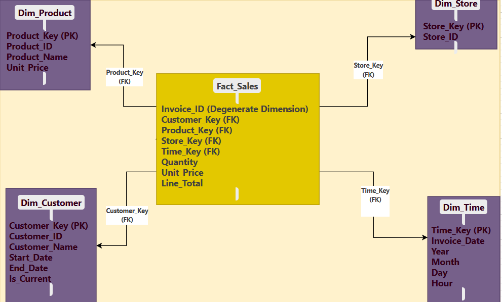

# Invoice-Based Dimensional Modelling Assignment
`Slack Id` Adordev


## Overview

This assignment involves designing an end-to-end dimensional model for a mid-sized retail company based on a sample invoice dataset. Without explicit business requirements, we reverse-engineer the model from the data, focusing on dimensions like Customer, Product, Time, and Store. The solution supports analytical reporting, drill-down capabilities, historical tracking, and scalability, aligning with inferred objectives of analyzing sales trends, customer behavior, and store performance.

---

## 1. Data Profiling & Inference

### Identifying Dimensions

Analyzing the sample invoice dataset reveals key business entities that can be modeled as dimensions:

- **Customer Dimension**: Includes `Customer_ID` (e.g., C001) and `Customer_Name` (e.g., "John Smith"). This captures who is purchasing, enabling customer-centric analysis.
- **Product Dimension**: Comprises `Product_ID` (e.g., P1001), `Product_Name` (e.g., "Wireless Mouse"), and `Unit_Price` (e.g., 25.00). This describes what is sold, critical for product performance insights.
- **Time Dimension**: Derived from `Invoice_Date` (e.g., "2025-03-15 09:15:00"), with attributes like `Year`, `Month`, `Day`, and `Hour`. This supports temporal analysis of sales trends.
- **Store Dimension**: Based on `Store_ID` (e.g., S01), representing sales locations for store-level reporting.
- **Invoice Dimension**: `Invoice_ID` (e.g., INV001) acts as a degenerate dimension, a transactional identifier without additional attributes.

These dimensions are inferred from the dataset’s structure, reflecting the retail context of sales transactions.

### Determining Fact Table Granularity

The fact table granularity is set at the **invoice line-item level**, where each row represents a single product sold in a transaction (e.g., INV001 has two rows: one for "Wireless Mouse," another for "Mechanical Keyboard").

#### Justification:
1. **Detailed Analysis**: Enables queries like "How many Wireless Mice did John Smith buy at S01?" supporting fine-grained insights.
2. **Aggregation**: Allows summing `Line_Total` or `Quantity` across dimensions (e.g., total sales by store or product).
3. **Drill-Down**: Facilitates multi-level analysis, from yearly totals to hourly breakdowns, meeting the drill-down objective.

This granularity ensures flexibility for both operational and strategic reporting.

---

## 2. Dimensional Modeling Strategy

### Star Schema Design

A star schema integrates the fact table with conformed dimensions for simplicity and query efficiency.

#### Fact Table: `Sales_Fact`
| Attribute                  | Description                                      |
|----------------------------|--------------------------------------------------|
| `Sales_Key` (PK)           | Surrogate key for uniqueness                    |
| `Customer_Key` (FK)        | Links to `Customer_Dim`                         |
| `Product_Key` (FK)         | Links to `Product_Dim`                          |
| `Store_Key` (FK)           | Links to `Store_Dim`                            |
| `Time_Key` (FK)            | Links to `Time_Dim`                             |
| `Invoice_ID` (Degenerate)  | Transaction identifier (e.g., INV001)           |
| `Quantity`                 | Units sold (e.g., 2)                            |
| `Line_Total`               | Revenue per line item (e.g., 50.00)             |

#### Dimension Tables:
1. **Customer_Dim**
   - `Customer_Key` (PK)
   - `Customer_ID` (e.g., C001)
   - `Customer_Name` (e.g., "John Smith")
   - `Start_Date`, `End_Date` (for SCD)

2. **Product_Dim**
   - `Product_Key` (PK)
   - `Product_ID` (e.g., P1001)
   - `Product_Name` (e.g., "Wireless Mouse")
   - `Unit_Price` (e.g., 25.00)
   - `Effective_Start_Date`, `Effective_End_Date` (for SCD)

3. **Store_Dim**
   - `Store_Key` (PK)
   - `Store_ID` (e.g., S01)
   - `Store_Name` (assumed, e.g., "Downtown")

4. **Time_Dim**
   - `Time_Key` (PK, e.g., 202503150915)
   - `Date` (e.g., "2025-03-15")
   - `Year`, `Month`, `Day`, `Hour` (e.g., 2025, "March", 15, 09)

### Handling Degenerate Dimensions


`Invoice_ID` is a degenerate dimension, stored directly in `Sales_Fact` rather than a separate table. This simplifies the schema while allowing grouping by invoice (e.g., total revenue for INV001), aligning with reporting needs without adding complexity.

### Dimensional Model Diagram


---

## 3. Slowly Changing Dimensions (SCD)

### SCD Implementation

Attributes like `Unit_Price` (in `Product_Dim`) and `Customer_Name` (in `Customer_Dim`) may change over time, requiring an SCD strategy.

- **Product_Dim**: Use **SCD Type 2** for `Unit_Price`. Add `Effective_Start_Date`, `Effective_End_Date`, and a new row for each price change (e.g., "Wireless Mouse" from 25.00 to 30.00 on 2025-04-01).
- **Customer_Dim**: Apply **SCD Type 2** for `Customer_Name` changes (e.g., "John Smith" to "John A. Smith"), tracking historical purchases.
- **Store_Dim**: Use **SCD Type 1** for `Store_Name`, overwriting updates as location history is less critical.

#### Trade-Offs:
- **Type 2**: Preserves history (benefit) but increases storage and complexity (cost).
- **Type 1**: Simplifies maintenance (benefit) but loses historical data (cost).
- **Type 3**: Tracks one prior value but is impractical for frequent changes.

SCD Type 2 is chosen for `Product_Dim` and `Customer_Dim` to support historical tracking, aligning with forecasting needs.

---

## 4. ETL/ELT Strategy

### Data Integration

- **Batch Processing**: Extract daily invoice data (e.g., from a POS system CSV) and-
    - Extract daily invoice data (e.g., from a POS system CSV) nightly, transform, and load into the data warehouse.
- **Incremental Updates**: Process only new/changed records based on `Invoice_Date` (e.g., > last load date), reducing overhead.

### Data Quality & Consistency

1. **Surrogate Keys**: Generate `Customer_Key`, `Product_Key`, etc., for performance and SCD support.
2. **Cleansing**: Standardize `Customer_Name` (e.g., "John Smith" vs. "john smith") and validate `Line_Total`.
3. **Integrity**: Ensure foreign keys match dimension tables.
4. **Deduplication**: Remove duplicate `Invoice_ID` + line item entries.

#### ETL Process Flow
```
[Invoice CSV] --> [Extract: Load Rows] --> [Stage: Validate Line_Total, Dedupe]
    |
    v
[Transform: Parse Invoice_Date, SCD Type 2, Assign Keys] --> [Load: Dimensions → Sales_Fact]
```

---

## 5. Advanced Analysis & Scalability

### Hierarchical Relationships

- **Time**: `Year → Month → Day → Hour` (e.g., 2025 → March → 15 → 09).
- **Product**: Future `Category → Product_Name` (e.g., "Electronics → Wireless Mouse").
- **Store**: Potential `Region → Store_ID` (e.g., "East → S01").

### Performance Optimization

1. **Partitioning**: Split `Sales_Fact` by `Time_Key` (e.g., monthly) for faster queries.
2. **Indexing**: Index foreign keys (`Customer_Key`, etc.) and composite keys (e.g., `Store_ID` + `Time_Key`).
3. **Surrogate Keys**: Enhance join performance and SCD management.

---

## Assumptions & Trade-Offs

- **Assumptions**: No returns/refunds, `Store_Name` exists in a master list.
- **Trade-Offs**: SCD Type 2 increases storage but ensures history; line-item granularity adds detail but requires more space.

---

## Conclusion

This model delivers:
- **Analytical Reporting**: Sales trends via `Line_Total` aggregations.
- **Drill-Down**: Hierarchies enable multi-level analysis.
- **Historical Tracking**: SCD Type 2 preserves past data.
- **Scalability**: Partitioning and indexing ensure performance.

It meets all business objectives with a robust, scalable design.

---